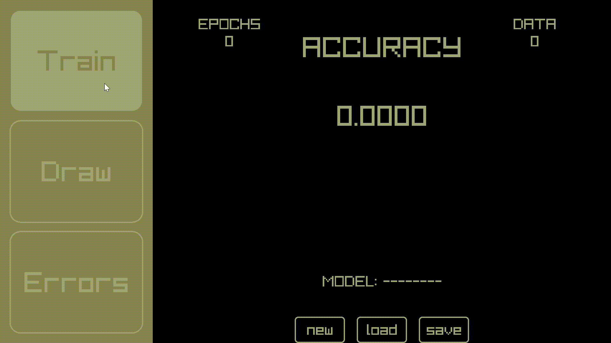

<h1 align="center">NetPanel</h1>

  

    <strong>GUI to control and visualize fully-connected neural networks with EnchephalonPrime library.</strong>
  

  

    
    
  

## ⚠️ This project is currently in development ⚠️
Some features may not be available at the moment.

## Description
Made with C++ using raylib to render and EncephalonPrime for the neural networks. NetPanel is a simple way to train and visualize this process. Allowing the user to create multiple neural networks, see it's errors and input data to test it. It currently supports only MNIST dataset.

## Training a Neural Network

    

## Autores

| [ @rafafelps](https://github.com/rafafelps)  |
| :---: |
